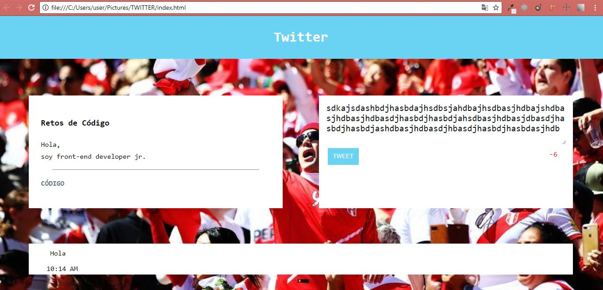

# Twitter

* **Curso:** _Creando tu primer sitio web interactivo_
* **Unidad:** _Creando interacción con JavaScript_

***

## Objetivos del reto

El reto consiste en:

* Replicar la página web de la red social Twitter.

## Consideraciones

* **Deadline** : Lunes 20, 1:30 PM